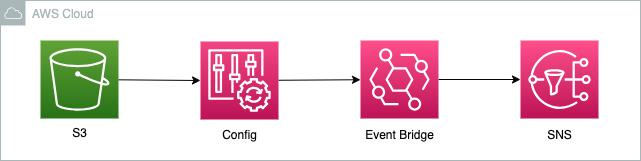
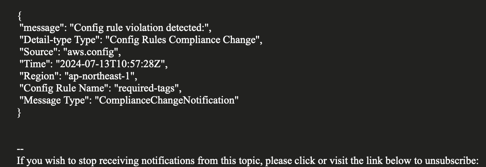

# AWS ConfigによるS3バケット Nameタグ監視 - EventBridgeとSNSで通知

<p align="center">
  
</p>


# 概要
このプロジェクトでは、S3バケットに「Name」タグが含まれているかを監視し、タグがない場合に通知を送信するAWSインフラをセットアップします。AWS Configルールを新規作成し、Amazon EventBridgeとAmazon SNSを使って効率的に通知を行います。

# 機能一覧
S3バケットのNameタグ有無の自動監視: AWS Configルールを用いて、新規作成・更新されるS3バケットに"Name"タグが付与されているかを自動でチェックします。

+ リアルタイムな検出と通知: Nameタグ未設定のバケットを検知すると、Amazon EventBridgeがイベントをトリガーし、即座に通知を行います。
+ 柔軟な通知設定: Amazon SNSを利用することで、管理者や担当者にメールで通知できます。通知先は複数設定可能です。
+ インフラ構成の自動化: AWS CloudFormationなどを利用することで、監視システム全体の構築を自動化できます。
+ 運用コストの削減: サーバーレスなアーキテクチャのため、監視システムの運用コストを最小限に抑えます。
+ セキュリティ強化: 適切なタグ付けを強制することで、S3バケットの管理体制を強化し、セキュリティ向上に役立ちます。

# インフラ構成

このプロジェクトのインフラ構成には、以下のAWSサービスが含まれます：

+ S3: ストレージサービス。監視対象のバケットがここに作成されます
+ AWS Config: 設定の評価とモニタリングサービス。S3バケットのタグを監視します
+ Amazon EventBridge: イベントバスサービス。AWS Configのルール違反を検知し、SNSに通知を送信します
+ Amazon SNS: 通知サービス。EventBridgeからのイベントを受け取り、指定されたメールアドレスに通知を送信します

# 起動とデプロイ方法

1. 以下のコードを実行してsnsから受信するアドレスを登録します。
```
bin/create_sns_email_file
```

2. event bridgeのdefaultの検出を開始する
    1. AWS マネジメントコンソールで Amazon EventBridge に移動します。
    2. メニューから「ダッシュボード」を選択します。
    3. 「リソース」欄からイベントバスを選択します。
    4. 「検出を開始する」ボタンをクリックします。

3. 以下のコードを実行してインフラを構築します。
```
bin/terraform_apply
```

# 停止
以下のコードを実行すると停止できます。
```
bin/terraform_destroy
```


# 結果

以下のメールが届きました。

<p align="center">
  
</p>


